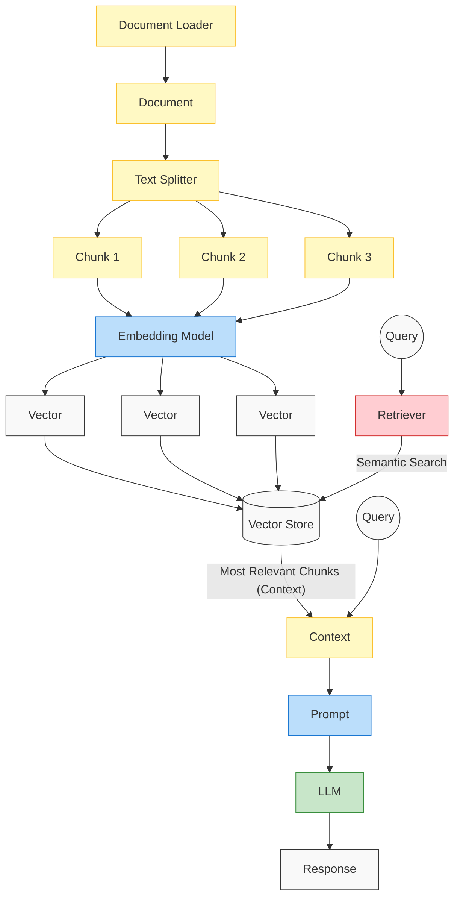

# Retrieval-Augmented Generation (RAG)

This module covers the concepts and implementation of Retrieval-Augmented Generation (RAG) using LangChain. 

## RAG Architecture

The following flowchart represents the standard RAG pipeline, which is divided into an **Ingestion** phase and a **Retrieval & Generation** phase.

### Components:
1. **Document Loader**: Loads data from a source (e.g., website, file).
2. **Text Splitter**: Breaks the large document into smaller, manageable chunks.
3. **Embedding Model**: Converts the text chunks into numerical vectors.
4. **Vector Store**: A database to store and quickly search these vectors.
5. **Retriever**: Takes the user's query and performs a semantic search against the Vector Store.
6. **Prompt**: Combines the retrieved context with the user's original query.
7. **LLM**: The Large Language Model processes the combined prompt to generate a final response.
